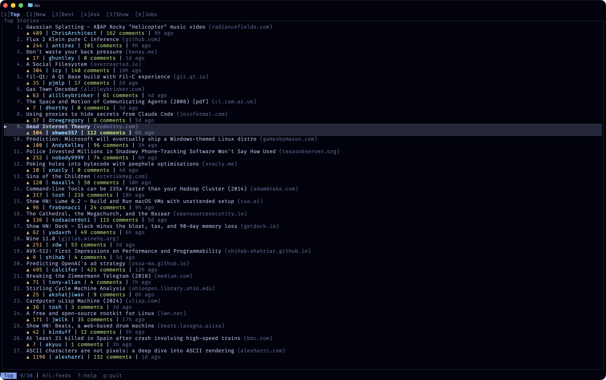
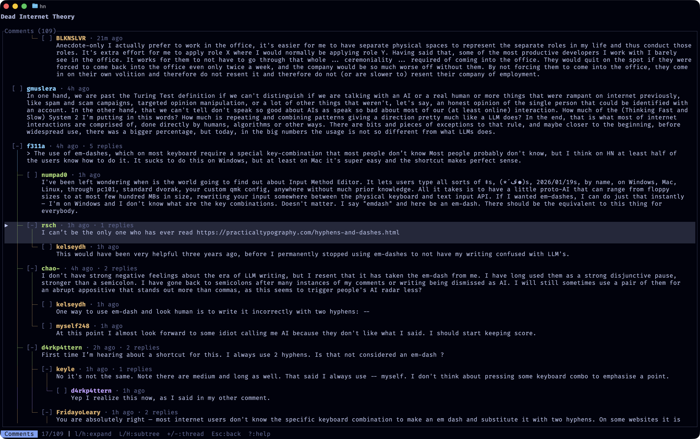

# hn

a terminal ui for hacker news.

i wanted something that felt like reading hn but without leaving the terminal.
this started as an experiment with running claude in a lima vm. it ended up being
pretty ergonomic, so i put it into `--dangerously-skip-permissions` mode and spent
a couple of evenings steering it around. liking it so far. it's fun adding features
to something that you personally want.





```
cargo install --path .
```

the binary is called `hn`.

## usage

```
hn                     # run it
hn --theme dracula     # pick a theme
hn --dark              # force dark mode
hn --light             # force light mode
hn theme list          # see available themes
```

## features

- vim keybindings (j/k, g/G, ctrl-d/u, the usual)
- six feeds: top, new, best, ask, show, jobs
- collapsible comment trees with depth coloring
- 12 built-in themes, or bring your own
- auto-detects terminal dark/light mode

## keys

| key     | action                    |
|---------|---------------------------|
| j/k     | move up/down              |
| g/G     | jump to top/bottom        |
| H/L     | prev/next feed            |
| 1-6     | jump to feed              |
| l/enter | open comments             |
| h/esc   | go back                   |
| o       | open url in browser       |
| c       | open hn comments in browser |
| r       | refresh                   |
| ?       | help                      |
| q       | quit                      |

in comments view, `l`/`h` expand/collapse. `L`/`H` do subtrees. `+`/`-` do entire threads.

## themes

comes with the classics: monokai, dracula, nord, gruvbox, solarized, catppuccin, tokyo-night. both dark and light variants where applicable.

custom themes go in `~/.config/hn/themes/` as toml files. run `hn theme show monokai` to see the format.

## architecture

follows elm-ish patterns: single app state, message-based updates, views are pure functions. ratatui does the rendering. the code is reasonably organized if you need to poke around.

## about

this started as a weekend project and then kept going. it's spirit quest vibe coded, which you can interpret however you like.
